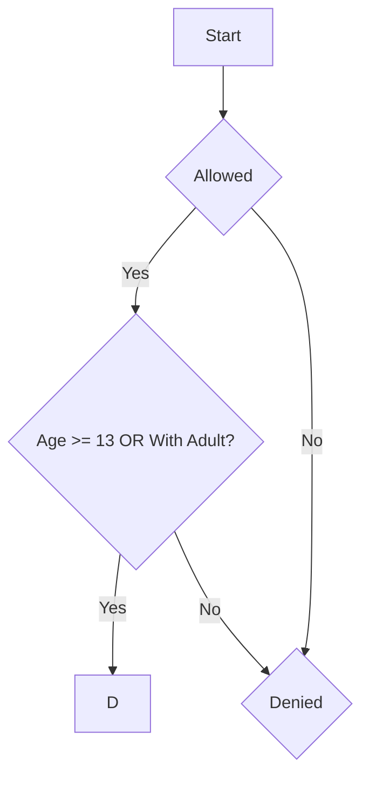

# Movie Theater Admission Policy
## A movie theater has the following admission policy. A person is allowed to enter if:
- Users are 13 years old or older, OR
- Users are accompanied by an adult. AND
- Users must have a valid ticket.

## Scenario
The theater checks if the users are allowed to enter or not.
They will be allowed if they satisfy the conditions of age, accompanied by adult, and a ticket.

## Variables
| Variable | Meaning |
|----------|---------|
| A | Age >= 13 |
| B | Accompanied by and Adult |
| C | Valid Ticket |

## Boolean expression 
### Condition 1
Can enter if:
Age >= 13
OR
Accompanied by and Adult

which is:
A OR B

### Condition 2
Must also have a ticket

which is:
(A OR B) AND C

### Truth Table
| A | B | C | A OR B | Admission    |
|---|---|---|--------|--------------|
| T | F | F |   F    |   Denied     |
|---|---|---|--------|--------------|
| T | F | T |   F    |   Denied     |     
|---|---|---|--------|--------------|
| T | T | F |   F    |   Denied     |     
|---|---|---|--------|--------------|
| T | T | T |   T    |   Allowed    |
|---|---|---|--------|--------------|
| F | F | F |    F   |   Denied     |     
|---|---|---|--------|--------------|
| F | F | T |    T   |   Allowed    |
|---|---|---|--------|--------------|
| F | T | F |    F   |   Denied     |
|---|---|---|--------|--------------|
| F | T | T |    T   |   Allowed    |      
|---|---|---|--------|--------------|

## Flowchart

## Logic Representation
( A OR B) AND C

## Conclusion
In this task, the movie theater admission policy was analyzed using Boolean logic. The rule can be written as:

(A OR B) AND C

where A is being 13 years old or older, B is being accompanied by an adult, and C is having a valid ticket.

Based on the truth table, a person is allowed to enter only if they meet the age requirement or are accompanied by an adult, and they have a valid ticket. This task showed how Boolean expressions and truth tables can be used to represent and evaluate real-life rules and decisions.