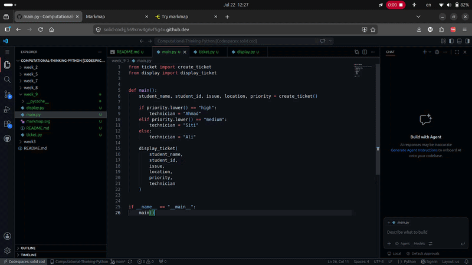

# 🎫 IT Helpdesk Ticket System

## 📌 Purpose of the Application
This is a simple **Ticket Registration System** built for the IT Support team at **City University Malaysia**. It allows students to report technical issues (e.g., LMS login problems, WiFi issues, printer malfunctions, password resets) by creating structured helpdesk tickets. The system automatically assigns a technician based on the priority level of the issue.

---

## 🛠 Tech Stack
- **Language**: Python 3.x
- **Programming Paradigm**: Modular Programming
- **Modules Used**:
  - `ticket.py` — Handles ticket creation and technician assignment logic
  - `display.py` — Handles formatted output/display of tickets
  - `main.py` — Main entry point and user interaction

---

## 🚀 How to Use
1. Run main.py
2. Enter student details.
3. Select High, Medium or Low priority.
4. View the generated helpdesk ticket.
    

